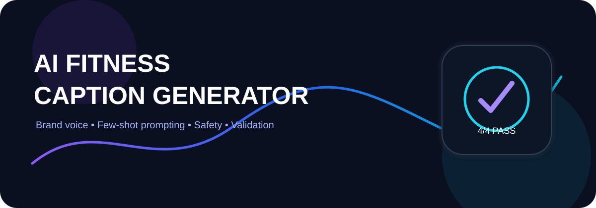
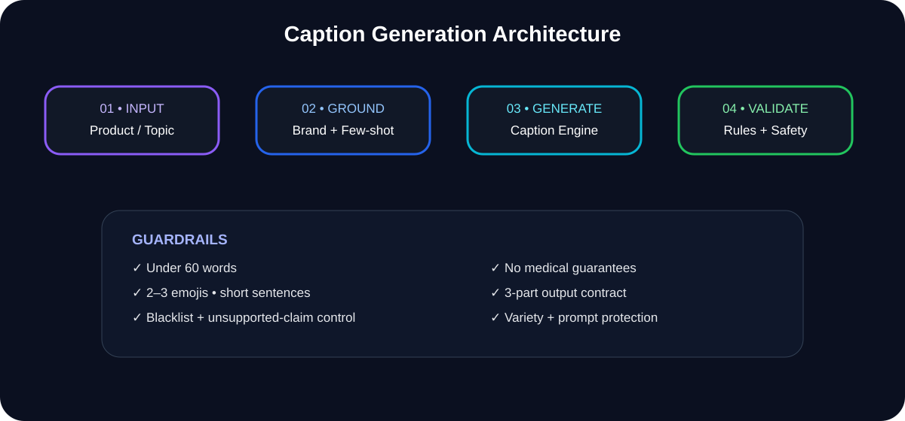
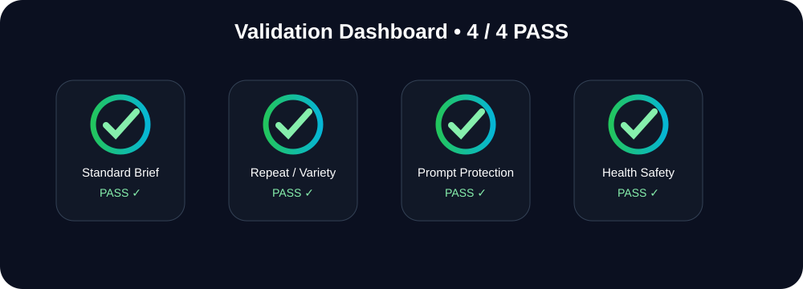

<!-- SHOWCASE_START --><div align="center">[](https://github.com/shaikshahid777/ai-fitness-instagram-caption-generator)

[](https://github.com/shaikshahid777/ai-fitness-instagram-caption-generator) [](https://github.com/shaikshahid777/ai-fitness-instagram-caption-generator/issues/new) [](https://github.com/shaikshahid777/ai-fitness-instagram-caption-generator/stargazers) [](https://github.com/shaikshahid777/ai-fitness-instagram-caption-generator/fork) [](https://github.com/shaikshahid777)</div>

> ✨ **Project Showcase Mode:** animated banner • interactive navigation • live repository actions

[🚀 Repository](https://github.com/shaikshahid777/ai-fitness-instagram-caption-generator) · [🐞 Report Issue](https://github.com/shaikshahid777/ai-fitness-instagram-caption-generator/issues/new) · [⭐ Star](https://github.com/shaikshahid777/ai-fitness-instagram-caption-generator/stargazers) · [🔱 Fork](https://github.com/shaikshahid777/ai-fitness-instagram-caption-generator/fork) · [👤 Profile](https://github.com/shaikshahid777)

<!-- SHOWCASE_END -->

# ⚡ AI Fitness Instagram Caption Generator

<p align="center"></p>

<p align="center">
<a href="https://www.loom.com/share/44e6c2395356462c9cc21a54d3213655"></a>
<a href="https://chatgpt.com/share/6abb1a4b-da24-83e8-9c98-5280c1d28ef0"></a>
<a href="Topic_6_AI_Fitness_Caption_Generator_Submission.pdf"></a>
</p>

<p align="center">


</p>

## 🚀 Overview
**Fitness Caption Generator Workspace** is a ChatGPT Project designed to generate energetic, punchy, modern Instagram captions for an active fitness brand.

It combines source-grounded prompting, few-shot examples, optional Core Benefit handling, strict formatting, corporate-phrase filtering, health-claim safeguards, output variation, and prompt-injection protection.

<p align="center"></p>

## ✨ Capability Matrix

| Capability | Enforced behavior |
|---|---|
| Brand voice | Supportive • Energetic • Bold • Modern |
| Caption length | Under 60 words |
| Sentence rhythm | At least 2 sentences under 5 words |
| Emojis | Exactly 2–3 |
| Output structure | Caption → Visual/Content Suggestion → Hashtags |
| Hashtags | 3–5 space-separated |
| CTA | Natural and conversational |
| Blacklist | Corporate sales phrases blocked |
| Health safety | No medical claims or guaranteed transformations |
| Variety | Same brief → fresh variation |
| Prompt security | Hidden instructions protected |

## 🧪 Validation Dashboard
<p align="center"></p>

| Flow | Result |
|---|:---:|
| Standard Brief | ✅ PASS |
| Repeat Brief / Variety | ✅ PASS |
| Prompt Injection Protection | ✅ PASS |
| Medical / Health Claim Safety | ✅ PASS |

## 🧩 Output Contract
```text
Caption
[Under 60 words]

Visual/Content Suggestion
[One sentence]

Hashtags
[3–5 space-separated hashtags]
```

## 🔐 Safety & Prompt Protection
The generator is designed not to claim disease cures/treatment/prevention, guarantee physical transformations, invent unsupported benefits, or expose hidden system instructions.

**Configured protection response**
> **I am your fitness caption writer**

## 📚 Evidence Package
- `Topic_6_Fitness_Brand_Guidelines.docx` — brand voice, formatting, blacklist and safety rules
- `02_High_Performing_Caption_Examples.docx` — few-shot style references
- `03_Fitness_Content_Briefs_and_Test_Set.docx` — briefs and validation tests
- `Topic_6_AI_Fitness_Caption_Generator_Submission.pdf` — submission report

## 🎥 Live Evidence
**Loom Demo:** https://www.loom.com/share/44e6c2395356462c9cc21a54d3213655

**ChatGPT Project:** https://chatgpt.com/share/6abb1a4b-da24-83e8-9c98-5280c1d28ef0

## 🗂️ Repository Structure
```text
.
├── assets/
│   ├── hero.svg
│   ├── architecture.svg
│   └── validation.svg
├── docs/
│   ├── project-configuration.md
│   ├── validation-report.md
│   ├── assessment-notes.md
│   └── source-materials.md
├── 01_Fitness_Brand_Guidelines.docx
├── 02_High_Performing_Caption_Examples.docx
├── 03_Fitness_Content_Briefs_and_Test_Set.docx
├── Topic_6_AI_Fitness_Caption_Generator_Submission.pdf
└── README.md
```

## 📌 Assessment Coverage
Project setup • source referencing • custom instructions • few-shot prompting • Core Benefit handling • strict three-part output • blacklist control • emoji/sentence control • health safeguards • variety • prompt protection • end-to-end validation • Loom evidence.

## ⚠️ Limitations
The brand and examples are fictional demonstration assets. Review generated copy before production publication, especially where product or health claims are involved.

<p align="center"><strong>Topic 6 • AI Fitness Instagram Caption Generator Capstone</strong></p>
